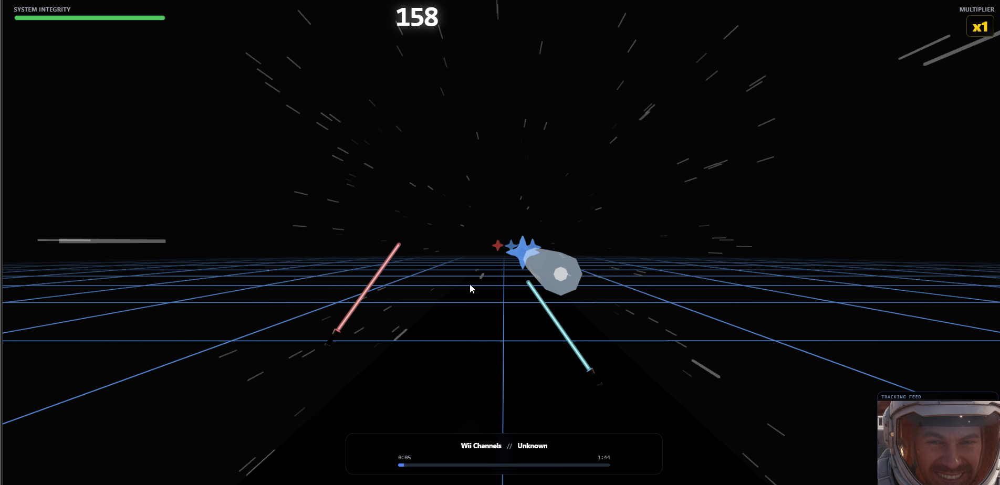

# Average Hero


A rhythm game powered by MediaPipe hand tracking. Use your webcam to slash notes to the beat!

## Features

*   **Hand Tracking Gameplay**: Use your hands to slash notes in 3D space.
*   **Custom Song Support**: Automatically loads MIDI files from the `songs/` directory.
*   **Dynamic Visuals**: Real-time feedback, particle effects, and a responsive HUD.
*   **Scoring System**: Combo multipliers and accuracy tracking.



## Getting Started

### Prerequisites

*   Node.js
*   A webcam

### Installation

1.  Install dependencies:
    ```bash
    npm install
    ```
    *Note: This project requires React 18.3.1 due to compatibility with `@react-three/fiber`.*

2.  Run the development server:
    ```bash
    npm run dev
    ```
    The game will start at `http://localhost:5555`.

## Adding Custom Songs

1.  Get a standard MIDI file (`.mid`).
2.  Place it in the `songs/` directory.
3.  Refresh the game. The song will automatically appear in the list!

## Controls

*   **Left Hand**: Controls the Red Saber.
*   **Right Hand**: Controls the Blue Saber.
*   **Slash**: Cut through the blocks in the direction indicated (or any direction for dot blocks).

## Credits

This project is built on top of "Tempo Strike" originally created by [Ammaar Reshi](https://x.com/ammaar).
